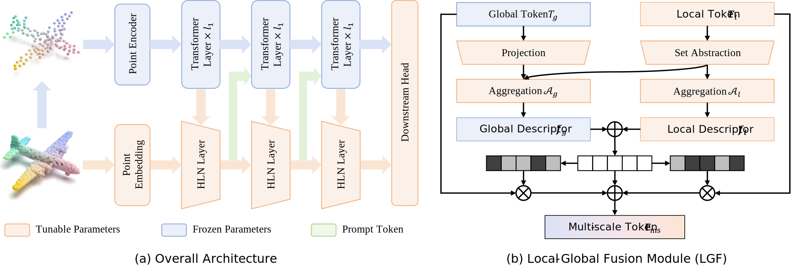

# Point Ladder Tuning

[](https://arxiv.org/abs/2607.19171)
[](https://eccv.ecva.net/)
<!-- [](paper/main.pdf)
[](paper/supplement.pdf) -->

Official implementation for **Point Ladder Tuning: Parameter-Efficient Hierarchical Adaptation for 3D Point Cloud Understanding**, accepted by **ECCV 2026**.

PLT is a parameter-efficient fine-tuning framework for 3D point cloud understanding. It freezes a pre-trained point-cloud backbone and learns a lightweight hierarchical adaptation path that preserves raw-point local geometry, fuses it with intermediate global semantics, and feeds instance-aware multi-scale prompts back into the frozen Transformer.

## News

- **2026-07-07**: PLT has been accepted by ECCV 2026.

## Abstract

Fine-tuning pre-trained point-cloud backbones by updating all parameters is costly and can discard useful pre-trained representations. Existing PEFT methods reduce the number of trainable parameters, but many of them operate mainly on heavily downsampled tokens, which limits their ability to recover fine-grained local geometry. PLT addresses this limitation with a construct-fuse-feedback design:

- **Hierarchical Ladder Network (HLN)** builds a multi-resolution local feature pyramid directly from raw points.
- **Local-Global Fusion (LGF)** selectively fuses local geometric cues with intermediate backbone semantics.
- **Dynamic prompt generation** injects instance-aware multi-scale prompts into the frozen backbone.
- **Lightweight dense-prediction head** progressively upsamples fused features for segmentation tasks.

In the paper, PLT achieves strong classification and dense prediction results while tuning only a small fraction of the backbone parameters.

## Overview

<p align="center">
  
</p>


## Installation

We recommend using a Conda environment with Python 3.9.

```bash
conda create -n plt python=3.9 -y
conda activate plt

# Install a CUDA-compatible PyTorch build. Example for CUDA 11.8:
pip install torch==2.0.0 torchvision==0.15.1 torchaudio==2.0.1 --index-url https://download.pytorch.org/whl/cu118

pip install -r requirements.txt
```

Install the point-cloud CUDA extensions:

```bash
# GPU kNN
pip install ./extensions/KNN_CUDA-0.2-py3-none-any.whl

# PointNet++ ops
cd extensions/Pointnet2_PyTorch/pointnet2_ops_lib
pip install -e .
cd ../../..

# Optional: needed by some pretraining/reconstruction code paths
cd extensions/chamfer_dist
python setup.py install --user
cd ../emd
python setup.py install --user
cd ../..

# Optional: needed by statistical processing of data
cd Dassl.pytorch
python setup.py install --user
cd ..
```

## Datasets

Please see [DATASET.md](DATASET.md) for download links.

## Project Structure

```text
cfgs/                  Training and dataset configs
datasets/              ModelNet, ModelNet few-shot, ScanObjectNN loaders
extensions/            CUDA extensions: KNN, PointNet++, Chamfer Distance, EMD
models/point_ladder.py PLT classification model and hierarchical adapter modules
tools/                 Training, evaluation, and checkpoint utilities
utils/                 Config, logging, distributed, and misc helpers
```

## Fine-tuning

### ModelNet40

```bash
CUDA_VISIBLE_DEVICES=0 python main.py \
  --config cfgs/finetune_modelnet_ladder.yaml \
  --ckpts <path/to/pretrained_backbone.pth> \
  --finetune_model \
  --exp_name plt_modelnet
```

### ScanObjectNN

```bash
# OBJ_BG
CUDA_VISIBLE_DEVICES=0 python main.py \
  --config cfgs/finetune_scan_objbg_ladder.yaml \
  --ckpts <path/to/pretrained_backbone.pth> \
  --finetune_model \
  --exp_name plt_scan_objbg

# OBJ_ONLY
CUDA_VISIBLE_DEVICES=0 python main.py \
  --config cfgs/finetune_scan_objonly_ladder.yaml \
  --ckpts <path/to/pretrained_backbone.pth> \
  --finetune_model \
  --exp_name plt_scan_objonly

# PB_T50_RS
CUDA_VISIBLE_DEVICES=0 python main.py \
  --config cfgs/finetune_scan_hardest_ladder.yaml \
  --ckpts <path/to/pretrained_backbone.pth> \
  --finetune_model \
  --exp_name plt_scan_hardest
```

## Evaluation

Evaluate a fine-tuned checkpoint:

```bash
CUDA_VISIBLE_DEVICES=0 python main.py \
  --test \
  --config cfgs/finetune_scan_hardest_ladder.yaml \
  --ckpts experiments/finetune_scan_hardest_ladder/cfgs/plt_scan_hardest/ckpt-best.pth \
  --exp_name test_plt_scan_hardest
```

Enable voting evaluation when needed:

```bash
CUDA_VISIBLE_DEVICES=0 python main.py \
  --test \
  --vote \
  --config cfgs/finetune_modelnet_ladder.yaml \
  --ckpts <path/to/finetuned_ckpt.pth> \
  --exp_name test_plt_modelnet_vote
```

## t-SNE Visualization

A t-SNE helper exists in `tools/runner_finetune.py` for ScanObjectNN-style classification features. In the current model file, `PointTransformerLadder.forward` returns logits only and the feature return path is commented out. Before running t-SNE, expose the classification feature, for example by returning both `ret` and `concat_f` in `models/point_ladder.py`.

```bash
CUDA_VISIBLE_DEVICES=0 python main.py \
  --config cfgs/finetune_scan_hardest_ladder.yaml \
  --ckpts <path/to/pretrained_or_finetuned_ckpt.pth> \
  --tsne \
  --exp_name tsne_scan_hardest
```

## Main Results

### 3D Object Classification

| Backbone | Tunable Params | ScanObjectNN OBJ_BG | ScanObjectNN OBJ_ONLY | ScanObjectNN PB_T50_RS | ModelNet40 |
| --- | ---: | ---: | ---: | ---: | ---: |
| Point-BERT + PLT | 0.60M / 2.71% | 91.57 | 89.85 | 86.09 | 93.5 / 94.2 |
| Point-MAE + PLT | 0.60M / 2.71% | 90.88 | 90.02 | 85.53 | 93.8 / 94.0 |
| ACT + PLT | 0.60M / 2.71% | 90.71 | 90.71 | 85.39 | 93.6 / 94.0 |
| PointGPT-L + PLT | 1.30M / 0.36% | 99.14 | 97.25 | 95.21 | 94.5 / 95.0 |

ModelNet40 results are reported as `without voting / with voting`.

### Dense Prediction

| Task | Backbone | Tunable Params | Metric |
| --- | --- | ---: | --- |
| S3DIS semantic segmentation | Point-MAE + PLT | 2.04M / 7.55% | 70.5 mAcc, 61.5 mIoU |
| S3DIS semantic segmentation | ACT + PLT | 2.04M / 7.55% | 70.6 mAcc, 61.5 mIoU |
| ScanNetV2 semantic segmentation | Point-BERT + PLT | 2.04M / 7.55% | 48.2 voxel mIoU, 47.8 point mIoU |
| ShapeNetPart part segmentation | Point-BERT + PLT | 2.08M / 7.69% | 83.85 class mIoU, 86.0 instance mIoU |
| ShapeNetPart part segmentation | PointGPT-L + PLT | 3.85M / 1.13% | 84.07 class mIoU, 86.2 instance mIoU |

### Few-shot Learning

| Backbone | 5-way 10-shot | 5-way 20-shot | 10-way 10-shot | 10-way 20-shot |
| --- | ---: | ---: | ---: | ---: |
| Point-BERT + PLT | 96.9 $\pm$ 2.0 | 98.8 $\pm$ 1.1 | 93.3 $\pm$ 4.0 | 95.5 $\pm$ 3.1 |
| ACT + PLT | 96.9 $\pm$ 1.8 | 98.9 $\pm$ 1.0 | 93.4 $\pm$ 4.0 | 95.9 $\pm$ 3.1 |

## Acknowledgements

This project follows the common point-cloud PEFT code style used by [DAPT](https://github.com/LMD0311/DAPT) and [PointGST](https://github.com/jerryfeng2003/PointGST). We also thank the authors of [Point-BERT](https://github.com/Julie-tang00/Point-BERT), [Point-MAE](https://github.com/Pang-Yatian/Point-MAE), [ACT](https://github.com/runpeidong/act), [PointGPT](https://github.com/CGuangyan-BIT/PointGPT), [IDPT](https://github.com/zyh16143998882/ICCV23-IDPT), [DAPT](https://github.com/LMD0311/DAPT), [PointGST](https://github.com/jerryfeng2003/PointGST), [Pointnet2_PyTorch](https://github.com/erikwijmans/Pointnet2_PyTorch), and related point-cloud pre-training and PEFT works.

## Citation

If you find this project useful, please cite:

```bibtex
@inproceedings{chang2026plt,
  title={Point Ladder Tuning: Parameter-Efficient Hierarchical Adaptation for 3D Point Cloud Understanding},
  author={Chang, Junlin and Zou, Longhao and Li, Rui},
  booktitle={European Conference on Computer Vision (ECCV)},
  year={2026},
}
```

## License

This repository is released under the Apache-2.0 license. See [LICENSE](LICENSE) for details.


